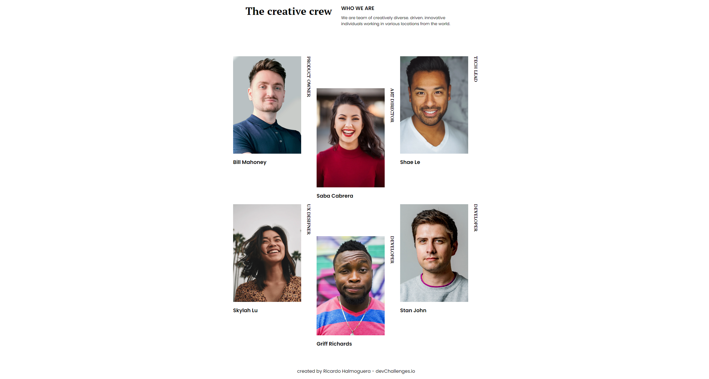
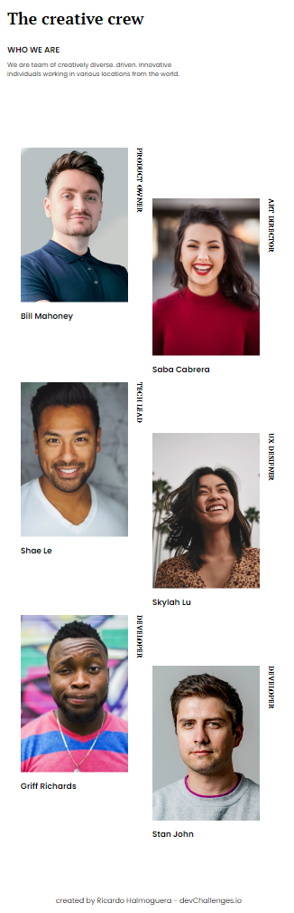

<!-- Please update value in the {}  -->

<h1 align="center">{Your project name}</h1>

   Solution for a challenge from  <a href="http://devchallenges.io" target="_blank">Devchallenges.io</a>.

  <h3>
    <a href="https://rickhalmoguera.github.io/my-team-page-master/">
      Demo
    </a>
     | 
    <a href="https://devchallenges.io/solutions/vpP9C5diIdYFTQfcs7DB">
      Solution
    </a>
     | 
    <a href="https://devchallenges.io/challenges/hhmesazsqgKXrTkYkt0U">
      Challenge
    </a>
  </h3>

<!-- TABLE OF CONTENTS -->

## Table of Contents

- [Overview](#overview)
  - [Built With](#built-with)
- [Features](#features)
- [Contact](#contact)
- [Acknowledgements](#acknowledgements)

<!-- OVERVIEW -->

## Overview
# Desktop Screenshot

# Mobile Screenshot

I present to you the second project of this challenge, where I applied the use of Flexbox and Grid. I tried to implement everything without using Media Queries, but unfortunately, I couldn't achieve it. As a result, you will find a media query in the code to achieve the desired photo organization effect.

### Built With

- [HTML](https://developer.mozilla.org/es/docs/Web/HTML)
- [Css](https://developer.mozilla.org/es/docs/Web/CSS)
- [FlexBox](https://css-tricks.com/snippets/css/a-guide-to-flexbox/)
- [Grid](https://css-tricks.com/snippets/css/complete-guide-grid/)

## Features

This site was created as a submission to a [DevChallenges](https://devchallenges.io/challenges) challenge. The [challenge](https://devchallenges.io/challenges/hhmesazsqgKXrTkYkt0U) was to build an application to complete the given user stories.

## Acknowledgements
>

- [Steps to replicate a design with only HTML and CSS](https://devchallenges-blogs.web.app/how-to-replicate-design/)
- [Node.js](https://nodejs.org/)
- [Marked - a markdown parser](https://github.com/chjj/marked)

## Contact

- Website [PORTFOLIO](https://rickhalmoguera.github.io/PORTFOLIO/)
- GitHub [@RickHalmoguera](https://github.com/RickHalmoguera)

